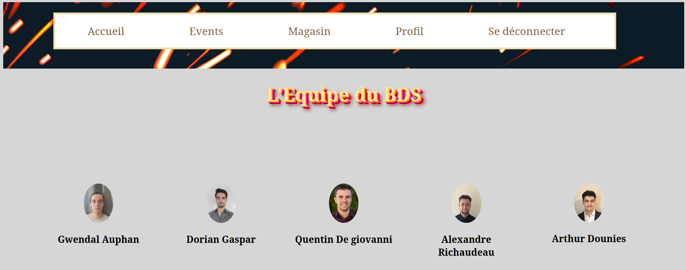

# Site Associatif - Développement Web

Ce projet est un site web pour une association sportive, intégrant un système d'authentification, une boutique en ligne et un module de gestion des événements.

## Fonctionnalités
- Authentification des utilisateurs : Gestion des identifiants pour accéder aux espaces réservés.
- Boutique en ligne : Affichage et gestion des articles.
- Événements : Consultation et gestion des événements de l'association.
- Stockage des données : Utilisation de fichiers texte (`.txt`) pour stocker les articles, événements et utilisateurs.

---

## Installation et Exécution

### Exécution locale avec PHP

#### Prérequis
- PHP installé sur votre machine.

#### Étapes
1. Installer PHP si ce n'est pas déjà fait.
2. Ouvrir un terminal dans le dossier contenant le fichier `index.php`.
3. Lancer le serveur PHP avec la commande suivante :
   ```bash
   php -S localhost:8000
   ```
4. Accéder au site :
   - Ouvrir un navigateur et entrer l'URL : [`http://localhost:8000`](http://localhost:8000).

---

### Exécution avec Docker

#### Prérequis
- Docker installé :
  - Linux : [Instructions officielles](https://docs.docker.com/engine/install/).

#### Construction de l'image Docker
Dans le répertoire du projet, exécutez la commande suivante :
```bash
docker build -t site_associatif_dev_web .
```

#### Exécution du conteneur
```bash
docker run -d -p 8000:80 site_associatif_dev_web
```

#### Accès au site
Ouvrir un navigateur et aller sur [`http://localhost:8000`](http://localhost:8000).

---

## Gestion des données

Les données du site (articles, événements, utilisateurs) sont stockées dans des fichiers `.txt`. Il n'y a pas de base de données relationnelle dans cette version.

---

## Page d'accueil


# Repos source
Base: https://github.com/gwendalauphan/Site_assioatif_Dev_web.git
