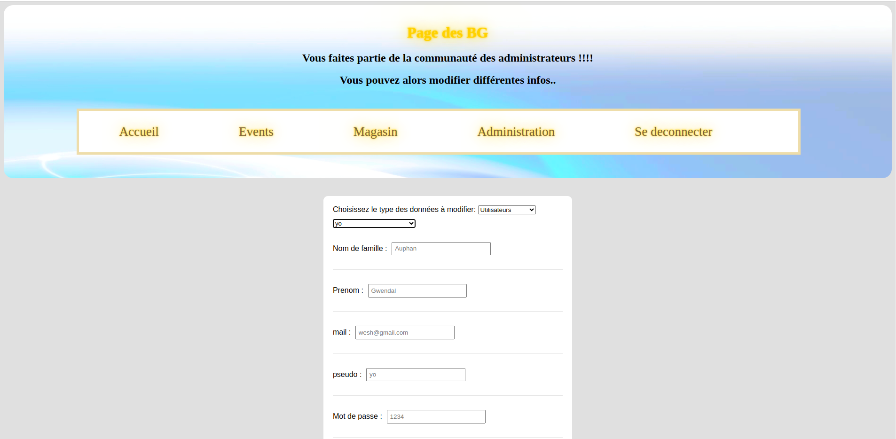
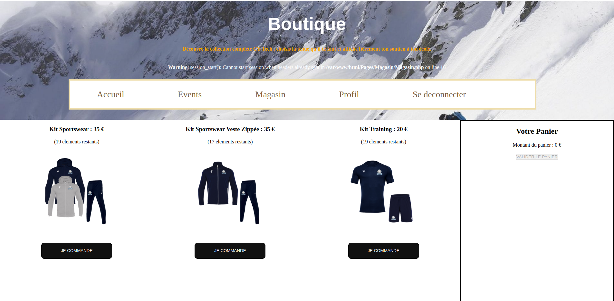

# Site Associatif de Développement Web

Ce projet consiste en la création d'un site web pour une association sportive. Il inclut des fonctionnalités de gestion des utilisateurs, une boutique en ligne et un système de gestion des événements.


### Disclaimer
Ne pas juger le design, s'il vous plaît 😂

## Fonctionnalités

- **Gestion des utilisateurs :** Inscription, connexion, et gestion de profil.
- **Boutique en ligne :** Gestion du stock et des prix des articles.
- **Gestion des administrateurs :** Permettre aux administrateurs de gérer le contenu et les utilisateurs.

## Prérequis

- Docker et Docker Compose pour la première méthode.
- PHP installé localement pour la deuxième méthode.

## Installation

### Méthode 1 : Utilisation de Docker

1. Installer Docker et Docker Compose.
2. Ouvrir un terminal et naviguer dans le dossier contenant `index.php`.
3. Donner les permissions nécessaires au dossier avec la commande :
   ```bash
   sudo chmod 777 -R BDD/
   ```
4. Démarrer les conteneurs Docker :
   ```bash
   docker compose up -d
   ```

### Méthode 2 : Utilisation de PHP Localement

1. Installer PHP sur votre machine.
2. Ouvrir un terminal et naviguer dans le dossier contenant `index.php`.
3. Démarrer le serveur PHP :
   ```bash
   php -S localhost:8000
   ```

## Utilisation

Après l'installation, ouvrir un navigateur web et accéder à l'URL suivante pour voir le site :
```
http://localhost:8000
```

## Technologies Utilisées

- **Backend :** PHP
- **Base de données :** Fichier texte pour la simplicité
- **Frontend :** HTML, JavaScript, CSS

## Aperçu



